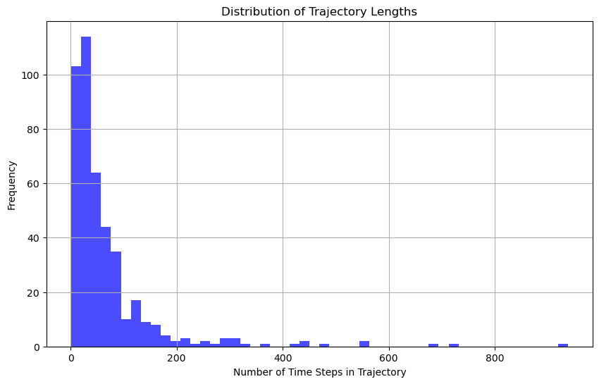
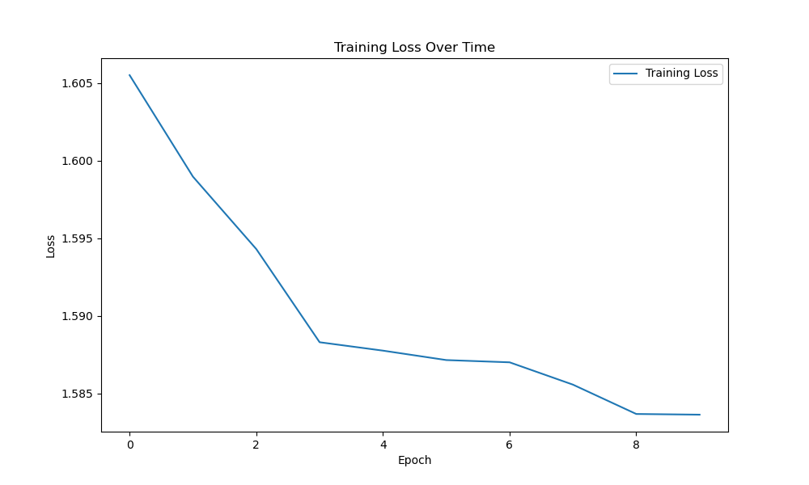
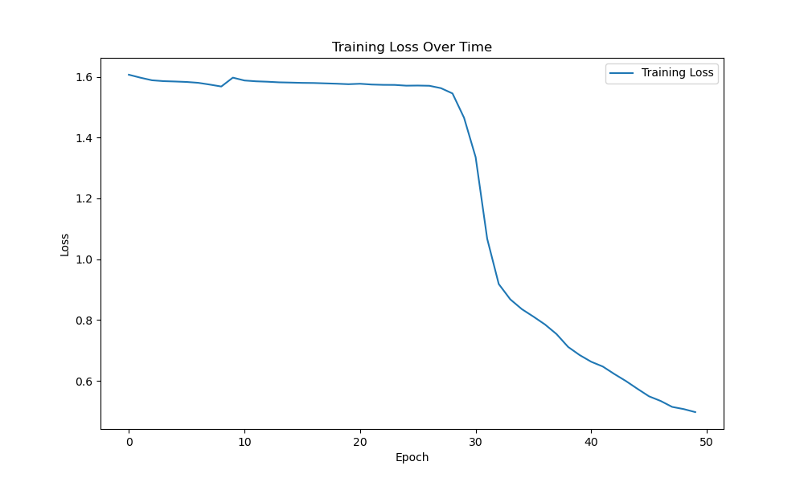

# Sequence Classification Using LSTM - Taxi Driver Trajectories

## Goal

The goal of this project is to take on a sequence classification task using deep learning. Given a dataset containing five taxi drivers' daily driving trajectories for 6 months, the objective is to build a NN to predict which driver a trajectory belongs to based on the testing set.

-----------------------------------
## Proposal

Since we are dealing with a sequence classification task, my proposal is that an LSTM network will best capture the sequential nature of the dataset. 

This repository is organized as follows:

    -- data
        -- {csv files containing raw driver data}
    -- images
        -- {png files containing charts/graphs}
    -- data_loader.py
    -- models.py
    -- evaluation.py
    -- preprocessed_data.csv 
-----------------------------------
## Methodology

### Data Preperation

Data loading and preprocessing steps are handled in the data_loader.py file. The following preprocessing steps were taken:

    1. Sorting and Grouping data by driver and day
    2. Handling Status column
    3. Extracting Features
    4. Normalizing Features

The data processing steps are handled inside data_loader.py, which includes two main functions:

    load_data(data_dir):
       
        Method that reads the data from the data directory into a pandas dataframe.

    preprocess_data(df):

        Method that preprocesses data.

        Output:
            Data: a new pandas dataframe containing the preprocessed data.
                dataset includes following normalized features:
                    - longitude
                    - latitude
                    - distance
                    - speed
                    - total_distance
                    - average_speed
                    - sin_time
                    - cos_time

        Distance, speed, sin_time, and cos_time are extracted features to improve our dataset. Distance is calculated by taking the geographic distance between two concurrent latitude/longitudes. Speed is then derived from distance and time different. Then, total_distance and average_speed are calculated for the entire length of a trajectory.
        
        Finally, time is converted into sin and cosine representation. This is done to capture the cyclical nature of time data.

        This function uses helper functions for each step, which are also defined in this module.

Sequence creation:

Sequence creation, model construction, and model training/evaluation are handled in models.py.

For this task, we will create sequences which will be fed to the model.
After looking at the trajectory lengths for each driver, we notice that sequence length is heavily right-skewed -- meaning that most trajectories are short, but there are a few very long ones. For a sample dataset from the data directory, we see the following attributes of trajectory lengths:

Since trajectories are of varying lengths, we will use padding and masking to handle variable-length sequences. We will pad sequences to the 9h percentile of the trajectory length distribution. This way, we'll preserve most of the data while keeping the sequence length manageable.

Padding - adding zeros to the end of sequences to make them all the same length.

To handle the sequences, we define a custom PyTorch dataset called SequenceDataset which stores the padded_sequences, targets, and legnths of each sequence. This is then fed to a DataLoader which handles batching. 

### LSTM Construction

Since were working on a sequence classification problem, I elected to implement an LSTM network. The model has the following architecture:

- LSTM layers
- Dropout layer for regularization
- Fully connected layer (for output)

Inputs:

    - input_size: number of features in input data
    - hidden_size: number of features in hidden state
    - output_size: number of features in output
    - num_layers: number of LSTM layers
    - dropout: dropout rate for regularization

### Model Training

For model training, we will create DataLoader to handle batch processing.
Then, feed the model through the training loop and monitor loss. To train the model, we use CrossEntropyLoss and the Adam Optimizer. After training mulitple models with varying hyperparameters (batch_size, learning rate, etc.), the top performing model had the following hyperparamters:

- learning_rate = .005
- batch_size = 32
- num_epochs = 10
- hidden_layers = 128
- num_layers = 3
- dropout = .2

I tested various numbers for each of these parameters and got varying results. Here is the training loss for the above parameters:

Test accuracy: ~23%

Here we see gradual decreasing loss, with a final loss around ~1.58 -- which is not very good. We also see a bad accuracy score on the testing data. Afer trying many different approaches to make an LSTM work, I decided to try out a different model. I implemented a GRU model with the following architecture:

        GRUClassifier(
        (gru): GRU(7, 256, num_layers=3, batch_first=True, dropout=0.2)
        (fc): Linear(in_features=256, out_features=5, bias=True)
        (dropout): Dropout(p=0.2, inplace=False)
        )

Since the two models are pretty similar, this process was not to difficult and it did not require too much updating of the parameters or training loop. Here are the results of the first GRU model:

We notice an interesting pattern. The model didn't seem to begin improving until around epoch 30 -- where we see a very sharp decline. By the end of epoch 50 the loss was still gradually improving its loss, indicating the model was still learning the dataset. Still, the total loss is not great at around ~.6 -- but still good progress. I retrained the LSTM model with a much higher number of epochs after noticing that it might be taking the model some time to even begin to learn the data.

I also added two new features in this step -- total_distance and average_speed. I added these features because I had a feeling that using distance and speed between two consecutive points, rather than across an entire sequence, was not properly capturing the nature of the dataset.

-----------------------------------
## Empirical Results and Evaluation

To evaluate the performance of the trained LSTM and GRU models, we used metrics such as accuracy and loss. The evaluation focused on how well the model predicted the correct label (plate number) for unseen trajectory data. The model was tested using a separate test set that was not seen during training. Before creating sequences, the entire dataset was split into 80% and 20% testing.

**LSTM  results after further tuning and longer training time:**

Test accuracy: 75.16%

Test loss:

Hyperparameters:

- learning_rate = .0005
- batch_size = 32
- num_epochs = 250
- hidden_layers = 256
- num_layers = 3
- dropout = .2

**GRU results after further tuning and longer training time:**

Test accuracy: 

*Fill in when model done training*

Test loss:

*Fill in when model done training*

Hyperparameters:

- learning_rate = .0005
- batch_size = 32
- num_epochs = 250
- hidden_layers = 256
- num_layers = 3
- dropout = .2

-----------------------------------
## Conclusion

Overall this task took a lot of time and data manipulation to get any meaningful results. Working with sequence data can be a challenging task and there were multiple obstacles that needed to be overcome to train a workable model. Some of the largest obstacles we faced were:

- Feature extraction
- How to create sequences and handle varying length trajectories
- Computational cost of training LSTM and GRU models
- Hyperparameter tuning, specifically num_epochs and learning rate

This was a good task to show the use cases of LSTM and GRU when working with sequence data. Future improvements could include experimenting with more advanced models like transformers or refining feature engineering to capture additional aspects of the trajectories. Despite these challenges, the project successfully showcased the application of deep learning techniques in analyzing and classifying sequential data for real-world scenarios.